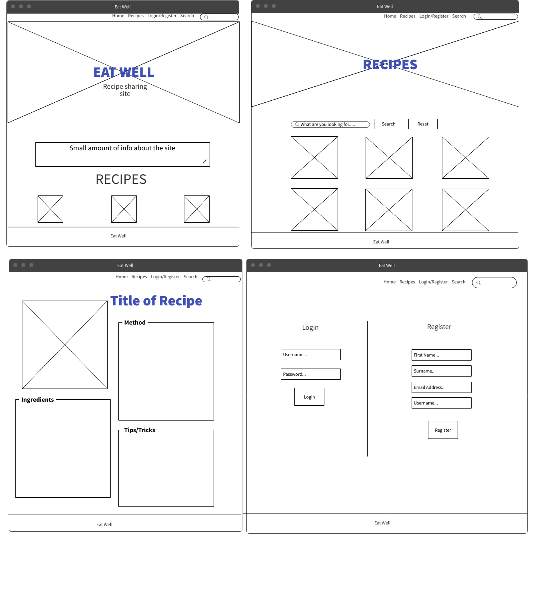
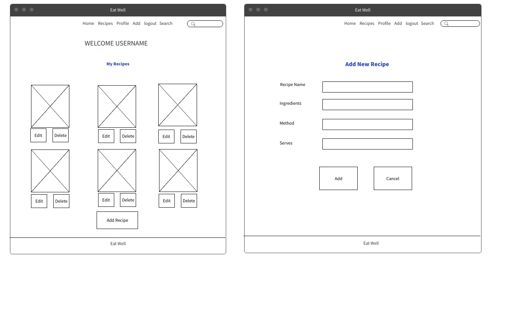
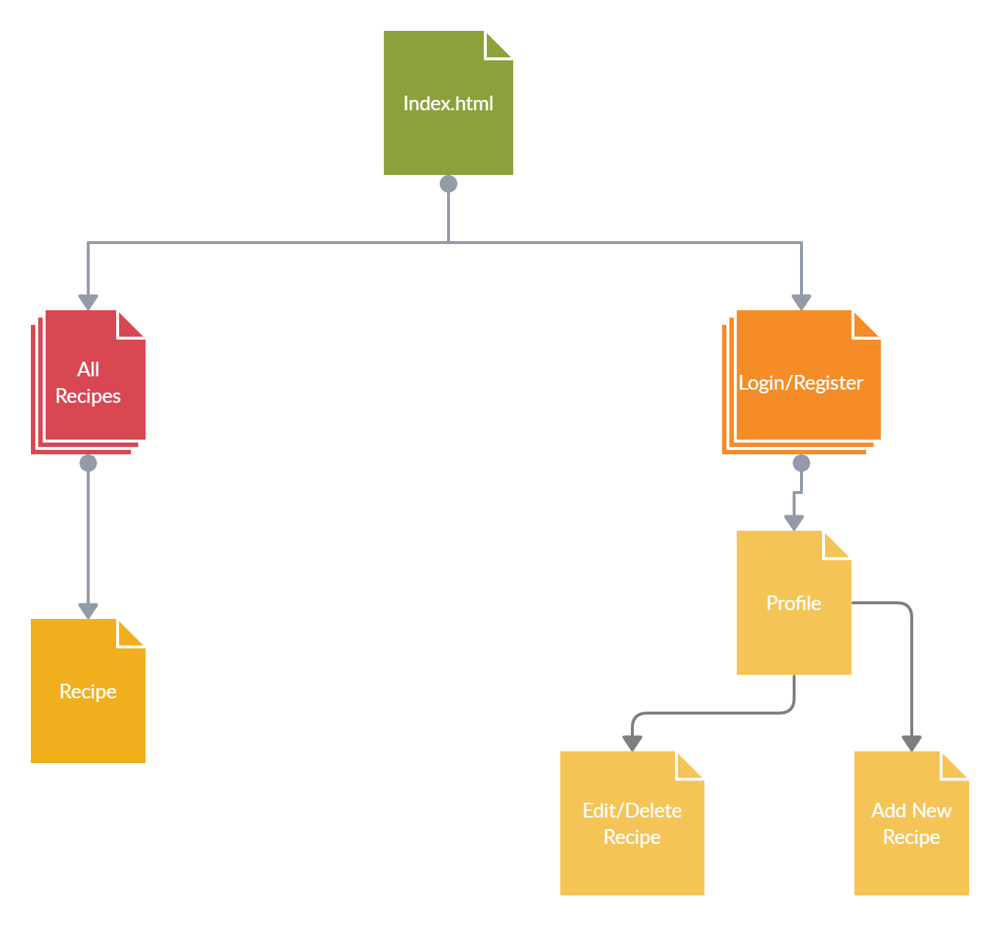

# **eat-well**
## **Project Overview**
Eat Well is a recipe sharing site, where users can create, share and edit recipes. 

This site has been developed to appeal to people of all walks of life, the site has a simple design which will mean that it will appeal to a wider audience and keeps the focus on the details of the recipes. 

For this project I have used HTML, CSS, JavaScript and Python to build the site making sure that it is fully responsive to the interaction of the user on what ever device. 

## **Table of Contents**
* [1.**UX**](#1-ux)
    * [**User Stories**](#user-stories)
    * [**Wireframes**](#wireframes)

## 1. **UX**
Overview of the UX design including the wireframes which have been created as a foundation for the site.

### **User Stories**
* As a user I would like to be looking at a clean and responsive webpage.
* As a user I would like to be able to clearly see the information of the recipes, so that I can find the relevant information. 
* As a user I want to have detailed information for the recipe I have chosen.
* As a user I want to be able to search for specific recipes and/or foods which I may want to make.
* As a user I would like to upload my own recipes for others to use.
* As a user I want to be able to edit and remove previous recipes I have uploaded.
* As a user I want to be able to register and login so that I can add recipes. 
* As a user I want to login so that I can edit or delete my previous recipes. 
* As a user I want clear feedback to know when I have completed an upload that it has been succesful. 
##### Admin
* As Admin I want to be able to edit and delete content to keep the site regulated.
* I want to be able to add new recipes and content to improve user experience.

## **Wireframes**
This website will be clean and easy to use, with a simple design and basic colour scheme.

#### Site Map

## **Structure**
From the above process (Wireframes and Sitemap) I was able to figure out the structure of this site. 
##### Home Page:
* Header: For easy navigation around the site
* Hero Image: The hero image is there for a clean and crisp design point of view, with the title of the site to be clearly seen. 
* Recipe Cards: For user to see some of the sites content with small description of key information and visual image.
* Search Bar: Text input search bar, for the user to search within the site for desired recipe or specific food.
* Search Result: Once search is submitted this will replace recipe cards with the chosen search results.
##### Recipes Page:
* Hero Image: Different to the Home Page image, relevant to the recipe page, with the title Recipes.
* Recipe Cards: Visual images with recipe title, brief description, serving size and total time to cook will be displayed.
* Search Bar: Text input search bar, for the user to search within the site for desired recipe or specific food.
* Search & Cancel Buttons: Buttons to enter the search or clear the search results to take user back to all the recipes.
##### Individual Recipe Page:
* Recipe Title: To provide user the name of the chosen recipe.
* Recipe Image: To provide user an image of the finished dish. 
* Method: To provide the user with information on how to prepare the food. 
* Ingredient List: To provide the user with the items needed to complete this recipe.
* Tips and Tricks: To provide the user with any additional information if needed.
##### Login & Register Page:
* Username Input: Text input box to allow user to type in their username.
* Password Input: Text input box to allow user to type in their password.
##### Profile Page:
* Welcome User Banner: Title which will welcome the user to their profile.
* User Recipe Cards: The recipes this user uploaded are shown within this page.
* Add New Recipe Button: Button to allow user to upload a new recipe.
* Edit/Delete Buttons: Buttons with each recipe card to allow user to edit or delete their recipes.
##### Add New Recipe Page:
* Recipe Name: Text input box for user to enter recipe name
* Description: Text input box for user to enter a small description of the recipe within 25-100 characters.
* Ingredients: Text input box for user to enter ingredient list as a list.
* Method: Text input box for user to enter the method of the recipe as a list.
* Serves: Text input box for user to enter the amount of people it serves numerically. 
* Total Time: Text input box for user to enter total time it takes to prepare the meal in hh:mm.
* Image Upload: File upload option for user. 
##### Edit Recipe Page:
* Recipe Name: Text input box for user to edit recipe name
* Description: Text input box for user to edit a small description of the recipe within 25-100 characters.
* Ingredients: Text input box for user to edit ingredient list as a list.
* Method: Text input box for user to edit the method of the recipe as a list.
* Serves: Text input box for user to edit the amount of people it serves numerically. 
* Total Time: Text input box for user to edit total time it takes to prepare the meal in hh:mm.
* Image Upload: File upload option for user to change picture.
* Update Button: Update button for user to finalise the edit.
* Reset Button: For user to reset back to previous information.
* Delete Button: For user to delete this recipe.
##### Footer:
* Footer: This is a small area on the page to contain the copyright and social media links. 

## Acknowledgements
* Wireframes created on [Mockflow](https://mockflow.com/)
* Sitemap created on [Creately](https://creately.com/)

