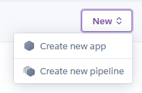
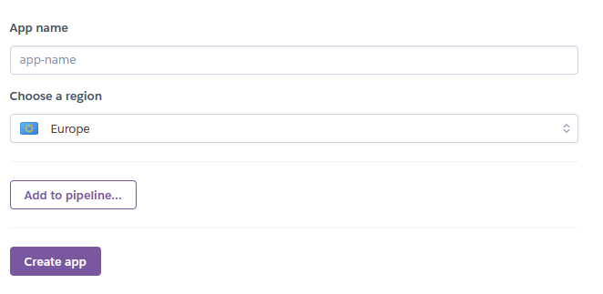
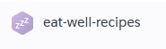
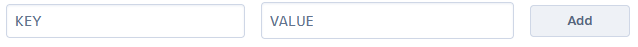
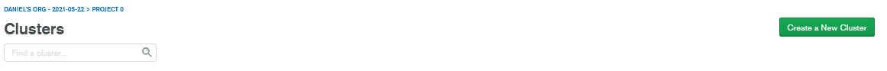

# **eat-well**
## **Project Overview**
Eat Well is a recipe sharing site, where users can create, share and edit recipes. 

This site has been developed to appeal to people of all walks of life, the site has a simple design which will mean that it will appeal to a wider audience and keeps the focus on the details of the recipes. 

For this project I have used HTML, CSS, JavaScript and Python to build the site making sure that it is fully responsive to the interaction of the user on what ever device. 

## Deployed Site 


The live website can be found on this link [EAT WELL](https://eat-well-recipes.herokuapp.com)

## **Table of Contents**
* [1.**UX**](#1-ux)
    * [**User Stories**](#user-stories)
    * [**Wireframes**](#wireframes)
    * [**Sitemap**](#sitemap)
    * [**Structure**](#structure)
    * [**Design**](#design)
* [2.**Features**](#2-features)
    * [**Existing Features**](#exisitng-features)
    * [**Features to implement in the future**](#features-to-implement-in-the-future)
* [3.**Database Design**](#3-database-design)
* [4. **Technologies Used**](#4-tecnologies-used)
* [5. **Deployment**](#5-deployment)
* [6. **Credits**](#6-credits)
* [7. **Acknowledgements**](#7-acknowledgements)

## 1. **UX**
Overview of the UX design including the wireframes which have been created as a foundation for the site.

### **User Stories**
* As a user I would like to be looking at a clean and responsive webpage.
* As a user I would like to be able to clearly see the information of the recipes, so that I can find the relevant information. 
* As a user I want to have detailed information for the recipe I have chosen.
* As a user I want to be able to search for specific recipes and/or foods which I may want to make.
* As a user I would like to upload my own recipes for others to use.
* As a user I want to be able to edit and remove previous recipes I have uploaded.
* As a user I want to be able to register and login so that I can add recipes. 
* As a user I want to login so that I can edit or delete my previous recipes. 
* As a user I want clear feedback to know when I have completed an upload that it has been succesful. 
##### Admin
* As Admin I want to be able to edit and delete content to keep the site regulated.
* I want to be able to add new recipes and content to improve user experience.

## **Wireframes**
This website will be clean and easy to use, with a simple design and basic colour scheme.


#### **Site Map**


## **Structure**
From the above process (Wireframes and Sitemap) I was able to figure out the structure of this site. 
##### Recipes Page:
* Hero Image: Relevant to the recipe page, with the title Recipes.
* Recipe Cards: Visual images with recipe title, brief description, serving size and total time to cook will be displayed.
* Search Bar: Text input search bar, for the user to search within the site for desired recipe or specific food.
* Search & Cancel Buttons: Buttons to enter the search or clear the search results to take user back to all the recipes.
##### Individual Recipe Page:
* Recipe Title: To provide user the name of the chosen recipe. 
* Method: To provide the user with information on how to prepare the food. 
* Ingredient List: To provide the user with the items needed to complete this recipe.
* Tips and Tricks: To provide the user with any additional information if needed.
##### Login & Register Page:
* Username Input: Text input box to allow user to type in their username.
* Password Input: Text input box to allow user to type in their password.
##### Profile Page:
* Welcome User Banner: Title which will welcome the user to their profile.
* User Recipe Cards: The recipes this user uploaded are shown within this page.
* Add New Recipe Button: Button to allow user to upload a new recipe.
* Edit/Delete Buttons: Buttons with each recipe card to allow user to edit or delete their recipes.
##### Add New Recipe Page:
* Recipe Name: Text input box for user to enter recipe name
* Description: Text input box for user to enter a small description of the recipe within 25-100 characters.
* Ingredients: Text input box for user to enter ingredient list as a list.
* Method: Text input box for user to enter the method of the recipe as a list.
* Serves: Text input box for user to enter the amount of people it serves numerically. 
* Total Time: Text input box for user to enter total time it takes to prepare the meal in hh:mm. 
##### Edit Recipe Page:
* Recipe Name: Text input box for user to edit recipe name
* Description: Text input box for user to edit a small description of the recipe within 25-100 characters.
* Ingredients: Text input box for user to edit ingredient list as a list.
* Method: Text input box for user to edit the method of the recipe as a list.
* Serves: Text input box for user to edit the amount of people it serves numerically. 
* Total Time: Text input box for user to edit total time it takes to prepare the meal in hh:mm.
* Update Button: Update button for user to finalise the edit.
* Reset Button: For user to reset back to previous information.
* Delete Button: For user to delete this recipe.
##### Footer:
* Footer: This is a small area on the page to contain the copyright and social media links. 

### **Design**
I have made an effort to keep this site clean and tidy with pops of colour. 

#### Styling
##### Colours
With a simple title of Eat Well, I wanted to keep in tune with a simple design for this page. On the NavBar I am using the colour "Blue-Grey" and "White" font, this is to give a clean and modern colour scheme.

Within the site I have chosen to use accents colours to give the site a little more life. The search buttons are "Green" to search and "Red" to cancel, this follows into each card panel recipe to have a "Green" edit button and "Red" delete button. 

#### Font and Wording
This website has been written in a way to be informative but also casual, there has been an effort to keep technical langauge to a minimal amount.

I have use Two [Google Fonts](https://fonts.google.com/) which are "Lato" for the main headings and main text and "Handlee" for supportive headings just to break up the sharpness of "Lato". "Sans Serif" has been used as a safe back-up if the other fonts were to fail.

#### Styling Extras
I chose to use [Font Awesome](https://fontawesome.com/) for icons within this site, to highlight key areas within the recipes and on the forms. 

Within the Navigation, once the application is used on a small screen the navbar will collapse into a chicken drum stick as a dropdown navigation. This is intended to be light hearted and also to continue on with the food theme.

Cards have been used to keep the site tidy and clean, they will have images on each card. Currently they have an image I have created myself due to the fact that I could not figure out how to display individual images into a database, as I have not learnt this yet. 

## 2. **Features**
This site allows users to view, create, search, edit and delete existing recipes. Users can search this site for recipes using any words that they would like. Once a user creates a recipe this can be shown on their personal user page.
### **Exisiting Features**
##### The header
* Contains the name of the website, to help build familiarity amongst users
* NavBar allows the user to navigate around the site easily, within this they can also register and login.
##### Footer
* Copyright information.
* The social links for the EAT WELL company.
* Navigation links.
##### Home Page
* Title of the site is shown on this page, with Hero Image.
* A small card with a little piece of information about the site.
* The chance for user to login or register within the home page.
##### Recipe Page
* Recipes created by all users are displayed here.
* Search Bar for users to search the site for any recipe they would like.
* Search Results replace previous recipes with the matches for the search, these are shown on cards.
* If logged in the user will be able to edit or delete their own created recipes from within this page.
##### Login/Registration
* Username input area for user to create desired username or to enter their profile.
* Password input area for user to create or enter their profile.
* Login/Registration button to submit the form, to either register and new user or to log in existing user.
##### Add/Edit Recipe
* The User can add/change Recipe Name.
* The user can select category type of recipe from a dropdown menu.
* The user can add/edit ingredients with a click on the collection.
* The user can add/edit the recipe method steps with a click the collection.
* The user can select/change the serving size of the recipe with a slider.
* The user can also enter the total time it takes to complete the recipe.
* When the user is adding a new recipe there is a button to submit the recipe to the database.
* When the user is editing a recipe there is a submit button to submit the changes made. 
* If the user does not want to change anything they can cancel the change and this will take them back to their profile.
* Once submitted user will be returned to recipe page and a flash message will appear saying "Recipe succesfully added".
* Once editted user will be returned to recipe page and a flash message will appear saying "Recipe succesfully updated".
##### Profile Page
* The user profile page has a small hero image, with their username within that image.
* The user will be greeted with a flash message, which reads "Welcome ..Username..".
* The recipes the user has created will be displayed on this page, with options to edit or delete them. 

### **Features to implement in the future**
* Currently I have placed a default image within the recipe cards, so in the future I would love to allow users to add their own images to go with the recipe.
* To allow the users to add different dietary recipes, like vegan or vegetarian options. 
* Allow users who have a knowledge of nutrition to post blogs about the best ways to eat well and how to have a balanced diet.
* I would like users to be able to rate and comment on recipes. It would be helpful for users to also edit their comments once submitted or even delete them. 
* Add user admin page which allows admins to have control of all the user accounts and have the power to suspend or remove accounts. 
* Within the modals of the recipes information, to have videos of someone making the chosen recipe to go alongside the current information within the modal. 
* Allow users to share recipes straight to their social media account.
* Allow users to add ingredients straight into their supermarket shopping basket.

## 3. **Database Design**
MongoDB was the database used for the development of the website.
##### Structure of database
* Users:
   - _id: ObjectId
   - username: String
   - password: String
* Recipes:
    - _id: ObjectId
    - recipe_name: String
    - category_name: String
    - recipe_description: String
    - ingredient_list: Array
    - recipe_method: Array
    - serving_size: String
    - total_time: String
    - created_by: String
* Categories:
    - _id: ObjectId
    - category_name: String

#### Indexes

##### Recipes
1. Text index on recipe name, category name, recipe description, ingredient list and recipe method, allowing user to text search.
    ```
    mongo.db.recipes.create_index([
        ("recipe_name", "text"),
        ("category_name", "text"),
        ("recipe_description", "text"),
        ("ingredient_list", "text"),
        ("recipe_method", "text")
    ])
    ```
#### Queries

##### Browsing
1. Finding the recipes
    ```
    list(mongo.db.recipes.find())
    ```
##### Users
1. Find a specific user
    ```
    mongo.db.users.find_one(
            {"username": request.form.get("username").lower()})
    ```
2. Insert new user into database with username and password
    ```
    register = {
            "username": request.form.get("username").lower(),
            "password": generate_password_hash(request.form.get("password"))
        }
        mongo.db.users.insert_one(register)
    ```
3. Find all recipes created by session user
    ```
    recipes = list(mongo.db.recipes.find({"created_by": username}))
    ```
##### Searching
1. Find recipes from user inputted text search
    ```
    def search():
        query = request.form.get("query")
        recipes = list(mongo.db.recipes.find({"$text":  {"$search": query}}))
        return render_template("recipes.html", recipes=recipes)
    ```
##### Uploading
1. Adding a new recipe
    ```
    def add_recipe():
    if request.method == "POST":
        recipe = {
            "recipe_name": request.form.get("recipe_name"),
            "category_name": request.form.get("category_name"),
            "recipe_description": request.form.get("recipe_description"),
            "ingredient_list": request.form.getlist("ingredient_list"),
            "recipe_method": request.form.getlist("recipe_method"),
            "serving_size": request.form.get("serving_size"),
            "total_time": request.form.get("total_time"),
            "created_by": session["user"]
        }
        mongo.db.recipes.insert_one(recipe)
        flash("Recipe Succesfully Added")
        return redirect(url_for("get_recipes"))

    categories = mongo.db.categories.find().sort("category_name", 1)
    return render_template("add-recipe.html", categories=categories)
    ```
2. Edit recipe
    ```
    def edit_recipe(recipe_id):
    if request.method == "POST":
        submit = {
            "recipe_name": request.form.get("recipe_name"),
            "category_name": request.form.get("category_name"),
            "recipe_description": request.form.get("recipe_description"),
            "ingredient_list": request.form.getlist("ingredient_list"),
            "recipe_method": request.form.getlist("recipe_method"),
            "serving_size": request.form.get("serving_size"),
            "total_time":request.form.get("total_time"),
            "created_by": session["user"]
        }
        mongo.db.recipes.update({"_id": ObjectId(recipe_id)}, submit)
        flash("Recipe Succesfully Updated")
        return redirect(url_for("get_recipes"))

    recipe = mongo.db.recipes.find_one({"_id": ObjectId(recipe_id)})
    categories = mongo.db.categories.find().sort("category_name", 1)
    return render_template("edit-recipe.html", recipe=recipe, categories=categories)
    ```
##### Deletion
1. delete a recipe
    ```
    def delete_recipe(recipe_id):
        mongo.db.recipes.remove({"_id": ObjectId(recipe_id)})
        flash("Recipe Succesfully Deleted")
        return redirect(url_for("get_recipes"))
    ```

## 4. **Technologies Used**
#### Languages
* [HTML](https://en.wikipedia.org/wiki/HTML) - Programming language providing content and structure for the website.
* [CSS](https://en.wikipedia.org/wiki/CSS) - Programming language providing styling for the website.
* [JavaScript](https://en.wikipedia.org/wiki/JavaScript) - Programming language used for interactive elements of the website.
* [Python](https://en.wikipedia.org/wiki/Python_(programming_language)) - Programming language used to drive core site functionality including user login and push and retrieving database information.
#### Libraries 
* [Materialize CSS Framework](https://materializecss.com/) - Libary of pre-built HTML and CSS, used for various aspects of the site such as footer.
* [Font Awesome](https://fontawesome.com/) - Libary used for icons such as social links.
* [Google Fonts](https://fonts.google.com/) - Libary used for font styling.
* [jQuery](https://jqueryui.com/) - JavaScript libary used for simplification of JavaScript Scripts.
* [Flask](https://flask.palletsprojects.com/en/1.1.x/) - Micro framework to simplify Python scripts and web server tasks.
* [Werkzeug](https://werkzeug.palletsprojects.com/en/1.0.x/) - Python libary to manage user management integrity.

#### Editors
* [GitHub](https://github.com/) - Remote code repository.
* [GitPod](https://gitpod.io/) - Integrated Development Enviroment for writing, editing and saving code.
* [Creately](https://creately.com/) - Used to plan and visualise the website flow.
* [Mockflow](https://mockflow.com/) - Wireframes for visual of potential site look.

#### Tools
* [Am I Responsive?](http://ami.responsivedesign.is/#) - Responsive design image at the start of ReadMe.
* [Responsive Design](https://www.responsivedesignchecker.com/) - Used to check website response across device types.

#### Database Management
* [MongoDB](https://www.mongodb.com/) - Cloud based database management system, used for storing user profile and recipe information.

#### Deployment Platform
* [Heroku](https://www.heroku.com/) - Remote hosting platform, for hosting of python driven websites and applications.

## .5 **Deployment**
#### Application Hosting
The site is hosted using [Heroku](https://www.heroku.com/), deployed directly from the master branch of GitHub. The site will update automatically each time new commits are pushed to the master branch.

##### Creating a Heroku app
- From Heroku dashboard
    - Select "New"
    - Select "Create new app"
        
- Add new app details to form:
    - Add unique app name
    - Select region
    - Click "Create App"
        
##### Setting Environmental Variables
- From the Heroku dashboard:
    - Select your app
        
- Select "Settings" from the top menu:
    - Under 'Config Vars', select "Reveal Config Vars"
    - Add environment variables in key-value pairs, click "Add" to add additional pairings.
        
##### Deployment
- Create required deployment files in the repository:
    - requirements.txt
      - Lists the required python modules for Heroku to install.
    - To create:
      - In your IDE terminal, type: pip freeze > requirements.txt

    - Procfile
      -  Tells Heroku the command to launch the app.
    - To create:
      - in your IDE terminal, type: python app.py > Procfile

  - .gitignore
      - Lists files and directories which should be deployed to live app, such as files with environmental passkeys.
    - To create:
      - In your IDE terminal, type: touch .gitignore
      - List the files and directories to be excluded from live deployment, within the .gitignore file.
      - Save in your repository root directory.

- From the application top menu:
    - Select 'Deploy'
    - Choose your Deployment method:
    - Github:
      - Select your Github account.
      - Type in the repository name you wish to deploy.
      - Choose the correct repository from search results.
      - Select "Connect"
- Manual Deployment:
      - Choose the correct branch you wish to deploy from the drop-down.
      - Select "Deploy Branch"
      - Heroku will return "Your App has successfully deployed". If this shows an error, troubleshooting will be needed.
        
- Automatic Deployment:
    - From the application top menu:
    - Select 'Deploy'
    - Ensure app is connected to correct repository
    - Under 'Automatic Deployment' section:
    - Select 'Enable Automatic Deployment"

##### Installing Requirements
* install all requirements modules to local IDE
    ```
    pip3 install -r requirements.txt
    ```
##### Create collections in MongoDB
* Login to your MongoDB account
* Create a Cluster 
    
* Create your own database
##### Setup Environmental Variables
- Create a '.gitignore' file in the root directoy
- Add 'env.py' and '__pycache__/' to the file list within .gitignore
- Create a 'env.py' file
- In the 'env.py' file write the following code;

```
import os

os.environ.setdefault("IP", "0.0.0.0")
os.environ.setdefault("PORT", "5000")
os.environ.setdefault("SECRET_KEY", "[UNIQUE ID]")
os.environ.setdefault("MONGO_URI", "[UNIQUE ID]")
os.environ.setdefault("MONGO_DBNAME", "[UNIQUE ID]")

```
##### SECRET_KEY
This is required when using flash() and session() functions in flask. The key can anything, but it's safer to use a randomly generated secure key from websites such as [RandomKeyGen.com](https://randomkeygen.com/).
##### MONGO_URI
This is used to connect your app to your MongoDB Cluster.
##### MONGO_DBNAME
This is the name you gave your database in MongoDB, this will be found under the collections tab, under your cluster.

##### Running your Development Server
To launch a http server using the development mode for your app, use this command in your IDE: 
    ```
    python3 app.py http.server
    ```
The IDE will then open a port with the address for you to access.

## 6. **Credits**
### Research 
I used the following websites for reference and inspiration:
- [Tasty](https://tasty.co/)
- [BBC Good Food](https://www.bbcgoodfood.com/)
- [The Chunky Chef](https://www.thechunkychef.com/)

### Technical
* [Materialize Docs](https://materializecss.com/) - For guidance on the use of Materialize.
* [w3Schools](https://www.w3schools.com/) - For checking my code for proper syntax of HTML, CSS and python code.
* [Stackoverflow](https://stackoverflow.com/) - For researching and troubleshooting issues withing my code.
* [MongoDB Documentation](https://docs.mongodb.com/) - For researching and troubleshooting database code issues.

### Content

All text content on the site was writtent by myself, with the recipes taken from these sites;
- [Tasty](https://tasty.co/)
- [BBC Good Food](https://www.bbcgoodfood.com/)
- [The Chunky Chef](https://www.thechunkychef.com/)

### Media
The photos and images used on this site are from.
* [Unsplash](https://unsplash.com/) - for hero images
* [Canva](https://www.canva.com/) - for recipe card image

## 7. **Acknowledgements**
* A massive thanks to everyone on Slack who helped me through this project.
* A huge thanks to tutor support for their patience, guidance and suggestions.
* Big thanks to my wife for reviewing this website and offering advice on the styling.

