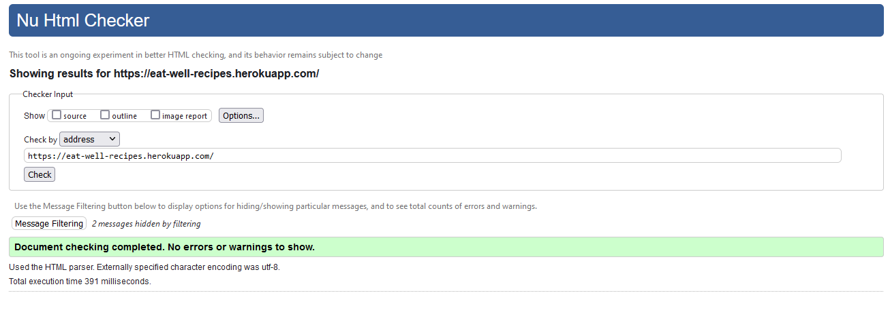
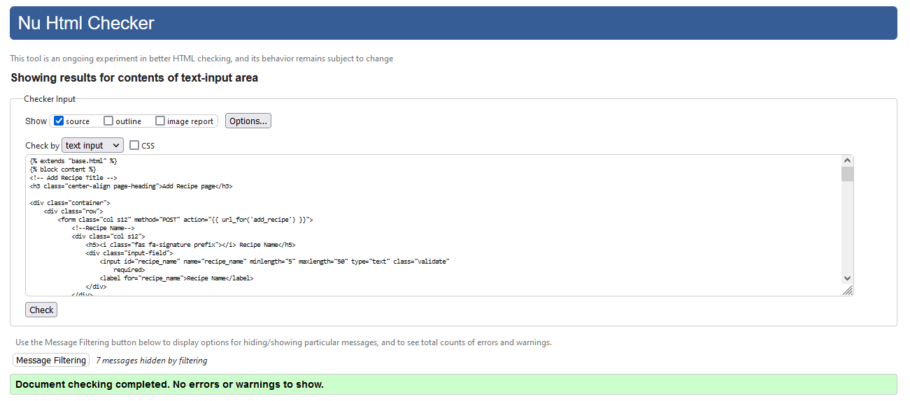
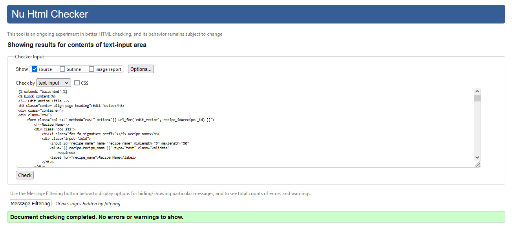
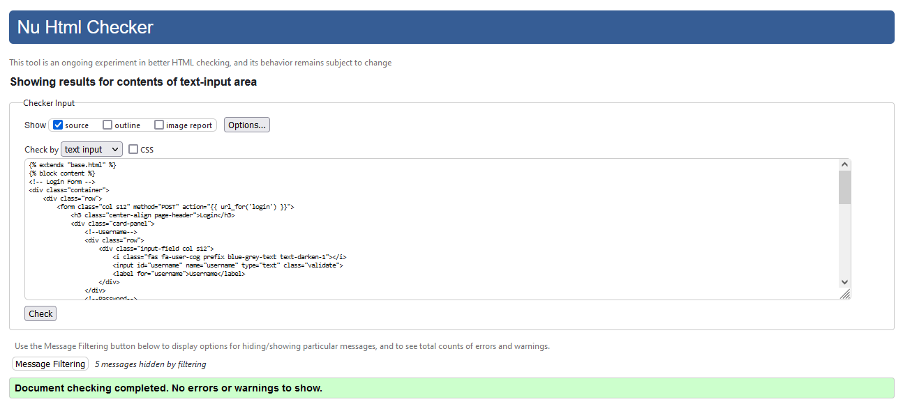
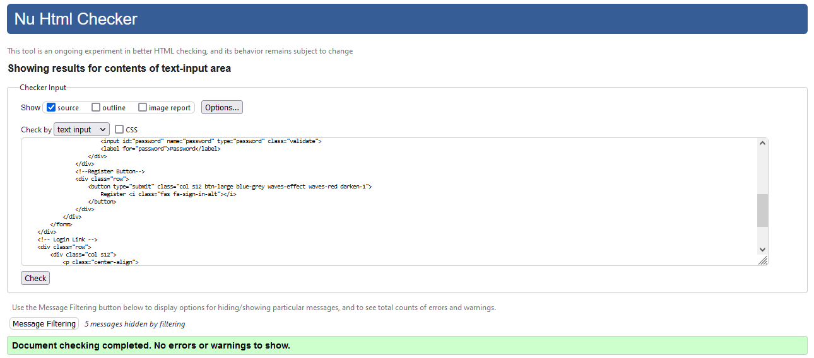
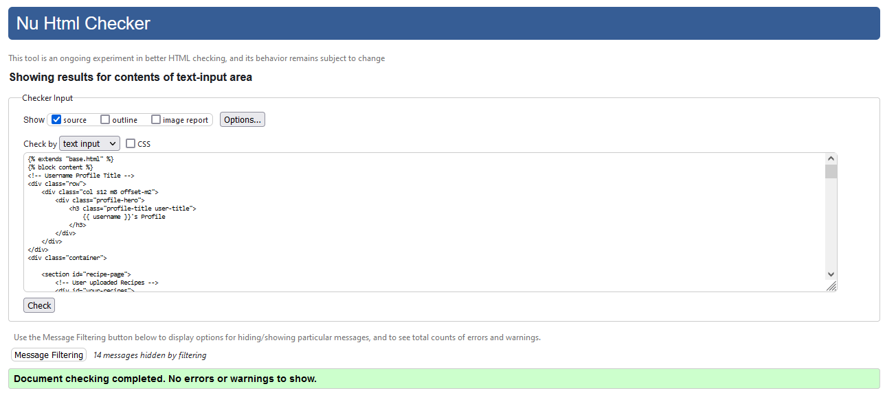
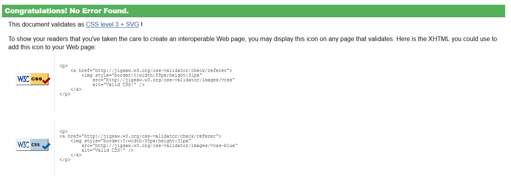

# EAT WELL Testing

- [**Validation**](#validation)
    * [W3 HTML](#w3-html)
    * [W3 CSS](#w3-css)
    * [JavaScript](#javascript)
    * [Python](#python)
- [**Testing User Stories**](#testing-user-stories)

## **Validation**

### W3 HTML
To validate my HTML, I used [W3 Validation Service](https://validator.w3.org/)

* base.html & home.html

* add-recipe.html

* recipes.html

The warnings are for semantics and lack of certain headers, I am happy with the headings that I do have so did not feel any changes were needed.

* edit-recipe.html

The warnings are for semantics and lack of certain headers, I am happy with the headings that I do have so did not feel any changes were needed.

* login.html

* register.html

* profile.html

The warnings are for semantics and lack of certain headers, I am happy with the headings that I do have so did not feel any changes were needed.

### W3 CSS
I validated the CSS with the [W3 Validation Service](https://jigsaw.w3.org/css-validator/) and it found no errors.

### JavaScript
I validated the JavaScript with [JSHint](https://jshint.com/).

### Python
I validated my Python code  via the [Pylint Validation Tool](https://www.pylint.org/) There are some issues, with the python code but overall I am happy with the score of 8.73/10.

## **Testing User Stories**
* As a user I would like to be looking at a clean and responsive webpage.
    - When a user visits the site they are shown a clean and uncluttered design which is responsive to the screen size they are using.
* As a user I would like to be able to clearly see the information of the recipes, so that I can find the relevant information. 
    - When a user clicks on a recipe that they like the look of, this will open up a modal with the information needed.
* As a user I want to have detailed information for the recipe I have chosen.
    - Once user has clicked on desired recipe, this will open a modal to give the user all the information needed to complete the recipe.
* As a user I want to be able to search for specific recipes and/or foods which I may want to make.
    - If the user types text into search bar, this will search the database for any matches and render them onto the recipe page for user to open.
* As a user I would like to upload my own recipes for others to use.
    - Once signed up to the site, the user is able to add their own recipes, through a dedicated page with an easy to use form to fill out.
* As a user I want to be able to edit and remove previous recipes I have uploaded.
    - User is able to edit and delete any recipe that they have created, they can edit all aspects of their own recipes.
* As a user I want to be able to register and login so that I can add recipes. 
    - Users are able to create profiles and have the ability to register and then also login.
* As a user I want clear feedback to know when I have completed an upload that it has been succesful.
    - When a user has completed a recipe or edited one there will be an appropriate message pop up, to allow user to know that their task was either created or edited.
##### Admin
* I want to be able to add new recipes and content to improve user experience.
    - Admin is able to just like users, add new content to enhance user experience.

## Issues I Faced
#### Searching the database
For a while I was only able to return matches on the search which matched within my title or description.
    To help me with this issue I first went to tutor support and we tried many things to correct this issue, but to no luck.

    I looked on Slack and found that people where having similar issues, and noticed a common theme in an issue with the database indexes. 

    I checked my database indexes and I had only indexed recipe_name and recipe_description. I was able to drop this index and create a new one to cover all the search areas I felt was needed.

#### Ingredients and Method within Modal
I was struggling to return the correct out put of my ingredient_list and recipe_method within my modal. 
    This was because I had not realised that I did not create a correct for loop for them within my modal. Once I created the correct for loop things where moving forwards, but for some reason I still was not returning what I wanted. 

    Within my database I had some recipes that had stored my ingredient_list and recipe_methods as strings rather than arrays, so I had to go back and delete these recipes and add some new ones with the correct structure and by doing that my modals returned the correct information.

#### Image upload
I really wanted to have the user be able to upload an image with their recipes, I did a lot of research and found cloudinary but unforunately could not grasp an good enough understanding of it to get it to work so I decided to leave this function for a later date. 

#### Recipe Card Sizes
I have been having a lot of issues getting the recipe cards to be the correct sizes on all devices, but I finally feel like I have managed to get them to look good on most devices.

## Issues Still to Fix
#### Admin
Admin to have the power to edit or delete any users content. 

#### Image Upload
As stated above, it would be amazing to have the user be able to upload their own images.

#### User Forgotten Password
It would be great to have a function to help users who have forgotten their login details.

